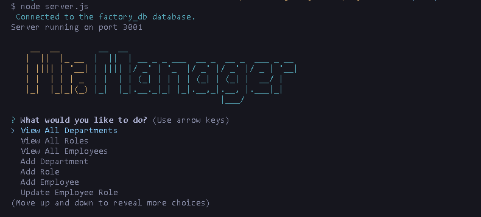

# MySQL Employee Database CLI

## Description

A command line interface application designed to view and manage the departments, roles, and employees in your company so you can organize and plan your business

## Table of Contents

- [Installation](#installation)
- [Usage](#usage)
- [License](#license)

## Installation

Using your bash terminal:

Check if you have node installed by running code below, this app was built using `v8.1.4`

If you don't, download it here: [Node.js](https://nodejs.org/en/)

```
npm -v
```

After you `git clone` , navigate to the root folder containing `server.js` and install the node modules with:

```
npm install
```  

## Usage

For a video demo of the apps functionality go to: [Video Demo](https://drive.google.com/file/d/1U66U-2YwF4N71jMftmhDt4wySydis9Cp/view)

Once you've opened the app in vscode and installed the node modules run:

```
node server.js
```

You will then be prompted with a series of questions to create your team members.

You should see the following:



## License

This app is licensed under the [MIT License](./LICENSE)

## How to Contribute

Reach out on [GitHub](https://github.com/Tooboi)
